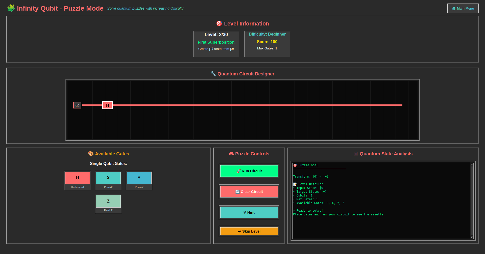
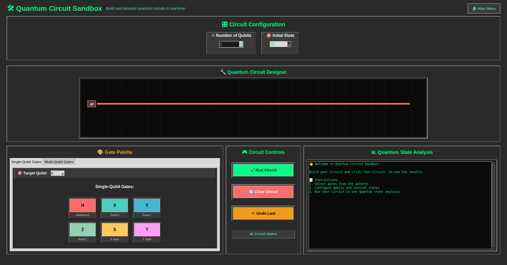
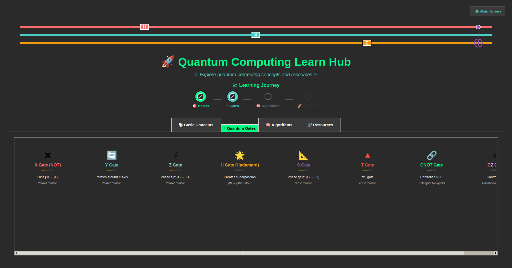

# ⚛️ Infinity Qubit

**A Quantum Computing Puzzle Game for Curious Minds**

Welcome to **Infinity Qubit**, an interactive educational game where you learn quantum computing by solving logic-based puzzles using real quantum gates.

---

## 🚀 Quick Start

### 🧱 Requirements

- Python 3.8+
- `qiskit >= 1.0.0`
- `qiskit-aer >= 0.13.0`
- `numpy >= 1.24.0`
- `pygame >= 2.0.0`
- `matplotlib >= 3.6.0`
- `scipy >= 1.10.0`
- `pillow >= 9.0.0`

Install dependencies:

```bash
pip install -r requirements.txt
```

### ▶️ Launch the Game

```bash
python3 run_game.py
```

---

## 🎮 Game Modes

| Mode         | Description                                             |
| ------------ | ------------------------------------------------------- |
| 🧪 Tutorial  | Learn how quantum gates work with hands-on guidance     |
| 🧩 Puzzle    | Solve quantum circuit challenges across multiple levels |
| 🧱 Sandbox   | Freely build and simulate quantum circuits              |
| 📘 Learn Hub | Explore quantum concepts and gate theory                |

---

## 🧠 Educational Goals

- Understand superposition, entanglement, and quantum gates.
- Practice building circuits with H, X, Z, CNOT, and more.
- Learn through guided hints, visual feedback, and sound effects.

---

## 🖼️ Visuals

### Puzzle Mode in Action



### Sandbox Circuit Builder



### Learn Hub Content



---

## 📁 Project Structure

```
├── run_game.py            # Entry point
├── main.py                # Launches splash screen
├── splash_screen.py       # Game splash visuals
├── game_mode_selection.py # Menu interface
├── tutorial.py            # Puzzle gameplay logic
├── sandbox_mode.py        # Freeform circuit builder
├── learn_hub.py           # Quantum concepts explorer
├── levels.json            # Level data
├── Quantum_Background.jpg # Visual background
└── requirements.txt       # Python dependencies
```

---

## 🤝 Contributing

Have ideas or feedback? Fork the repo, open an issue, or submit a pull request!

---

## 📫 Contact

Created by Quantum Qubit Qrew. For inquiries, reach out at QuantumQubitQrew@protonmail.com.

---

## 🧬 Enjoy exploring the quantum realm!
